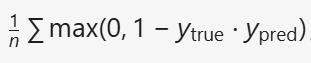

# 深度学习一到十章笔记
## （1）前备知识
### 1.什么是机器学习
机器学习是使用算法分析数据，从数据中学习，然后对新数据做出确定或预测的做法。
    
    关键词：从数据中学习 预测
### 2.机器学习与普通编程的区别
普通编程由人决定做什么事及给出相关的判断依据，机器学习则通过海量的数据自行寻找数据的特征点并进行处理。
## （2）深度学习基本了解
### 1.什么是深度学习
深度学习是机器学习的一个子领域，它使用受大脑神经网络结构和功能启发的算法。

    独特之处：模拟大脑神经网络

### 2.人工神经网络
人工神经网络 （ANN）：深度学习中使用的神经网络，别名有网，神经网络，型。
相关术语：
1. 人工神经网络是使用我们所谓的神经元构建的。
2. ANN 中的神经元被组织成我们所说的层。
3. ANN 中的图层（除输入和输出图层之外的所有图层）称为隐藏图层。
4. 如果 ANN 具有多个隐藏层，则称该 ANN 为深度 ANN。
---
1. [x] 小测知识点：
  模型从已经标记的数据中学习并进行推理属于监督学习。

#### 什么是人工智能网络：
人工神经网络是一种计算系统，它由一组称为神经元的连接单元组成，这些单元被组织成我们所说的层。

    关键词：神经元（节点），层
形象化：

#### 节点和层：
1. 神经元之间可以传递信息。
2. 节点之间进过组织后便会形成“层”。
3. 每个ANN中有三种类型的层：输入层，隐藏图层，输出层
4. 通过网络：数据从输入层开始流经网络，然后穿过隐藏层，直到到达输出层。
5. Input layer （输入层） - 输入数据的每个组件对应一个节点。（如在某一输入层中有两个节点，则需要输入两个维度的数据，比如身高和体重）
隐藏层 - 为每个隐藏层任意选择的节点数。
Output layer （输出层） - 每个可能的所需输出对应一个节点。（输出类也称为预测类）

### 3.如何使用Keras在代码中构建ANN
#### Sequential 模型：
深度学习模型的一种基础架构，其核心特点是线性堆叠的层结构。

线性堆叠：每一层的输出自动作为下一层的输入，形成一个单向数据流。

单输入单输出：模型仅支持单一输入和单一输出。

#### 代码构建：

1. 导入所需的类：
```py
from keras.models import Sequential
from keras.layers import Dense,Activation
```
注：
* Sequential：用于创建线性堆叠的神经网络模型容器
* dense 表示这些层的类型为密集层（隐藏层中的每个节点都连接到输出层中的所有节点），是ANN中最基本的层类型，其每个输出都是使用该层的每个输入计算的。
*  Activation：激活函数层

2. 用数组的形式创建层：
```py
layers = [
    #输入层和隐藏层
    Dense(units=3, input_shape=(2,), activation='relu'),
    #输出层
    Dense(units=2, activation='softmax')
]
```
注：
*  units 参数表示的是每个层中应该有多少个神经元。
*  input shape 参数告诉我们输入层有多少个神经元。
*  activation 用特定语句激活函数

3. 创建一个对应的对象：
```py
model = Sequential(layers)
```
---
1. [x] 小测知识点：

1.在神经网络编程中，每个隐藏层内的节点数是任意选择的
2.隐藏层节点数是需要根据任务复杂度、数据特性等独立设置的超参数，与输入层节点数无必然联系。
3.激活函数的作用是引入非线性因素，使得神经网络能够学习和表示复杂的非线性关系。
## （3）层
### 层的不同类型：
密集（或完全连接）层
卷积层
池化层
复发层
归一化层
### 图层权重：
两个节点之间的每个连接都有一个关联的权重，每个权重表示两个节点之间的连接强度。
当网络在输入层的给定节点收到输入时，此输入将通过连接传递到下一个节点，并且输入将乘以权重分配给该连接。
### 神经网络的正向传递：
获得给定节点的输出，获得的输出就是作为输入传递给下一层中的节点的值。此过程一直持续到到达输出层。
即

    从输入层到输出层的整个过程称为通过网络的正向传递。

### 如何使用使用 Keras 在代码中定义神经网络：
以下面这个网络为例：


```py
layers = [
    '''
    input_shape=(8,)：输入层有8个节点
    units=6：隐藏层有六个节点
    units=4：输出层有四个节点
    '''
    Dense(units=6, input_shape=(8,), activation='relu'),
    Dense(units=6, activation='relu'),
    Dense(units=4, activation='softmax')
]
```
用Keras 代表模型：
```py
'''
Sequential:序贯模型容器,用于按顺序堆叠神经网络层
Dense:全连接层
'''
from keras.models import Sequential
from keras.layers import Dense, Activation

layers = [
    Dense(units=6, input_shape=(8,), activation='relu'),
    Dense(units=6, activation='relu'),
    Dense(units=4, activation='softmax')
]
#搭建模型
model = Sequential(layers)
```
1. [x] 小测知识点：
1.在神经网络中，特定节点的输出取决于输入的加权和。

## （4）神经网络中的激活函数
### 1.激活函数的定义
在人工神经网络中，激活函数是将节点的输入映射到其相应输出的函数。

    节点输出 = 激活（输入的加权和）

激活函数执行时，总和转换为通常介于某个下限和某个上限之间的数字，此转换通常是非线性转换。

### 2.一些激活函数：
#### S型激活函数：


效果：
对于负输入，将输入转化为接近于0；
对于正输入，将输入转化为接近于1；

#### Relu 激活函数：
ReLU 是整流线性单元的缩写，它将输入转换为0或输入本身。
```c
// pseudocode
function relu(x) {
    if (x <= 0) {
        return 0;
    } else {
        return x;
    }
}
```
### 3.使用 Keras 的代码中的激活函数
1. 在构造层的时候使用：
model = Sequential([
    Dense(units=5, input_shape=(3,), activation='relu')
])
2. 在模型实例化之后将层和激活函数添加：
model = Sequential()
model.add(Dense(units=5, input_shape=(3,)))
model.add(Activation('relu'))

## （5）训练人工神经网络
### 1.什么是训练
训练模型是尝试优化模型中的权重，找到最准确地将输入数据映射到正确输出类的权重。
实现方法：通过网络重复发送相同数据的过程被视为训练。
### 2.算法
#### 优化算法（optimization algorithm）：
其中一种为随机梯度下降法（stochastic gradient descent，SGD）。
其目标为使损失函数的值尽量小。
#### 损失函数（loss function）：
损失：网络对数据的预测与数据的真实标签之间的误差或差异
常用：（平方误差）squared error 
### 3.在人工神经网络中学习
#### 相关概念：
纪元（epoch ）：在训练期间将整个数据集单次传递到网络。
梯度值（gradient value）：损失函数相对于权重的梯度。
学习率（Learning rate）：学习率告诉我们应该朝着最小方向迈出多大的一步。
#### 学习方式：
在开始训练前，网络的权重随机设置。一轮游后，利用生成的输出数据与原数据代入损失函数计算损失。
选择一个权重，计算损失相对于权重的梯度。从而更新模型的权重，并使它逐渐向损失函数的最小值靠近。（类比梯度下降法）
更新权重：将梯度乘以学习率，然后从权重中减去这个乘积，这将得到这个权重的新更新值。
### 4.使用 Keras 进行代码训练
```py
'''
下面的代码是构建一个ANN并进行训练
'''
#先导入要用到的类
import keras
from keras.models import Sequential
from keras.layers import Activation
from keras.layers.core import Dense
from keras.optimizers import Adam  #一种优化算法
from keras.metrics import categorical_crossentropy #一种损失函数
#定义模型
layers=[
    Dense(units=16,input_shape=(1,),activation='relu'),
    Dense(units=32,activation='relu'),
    Dense(units=16,activation='sigmoid')
]
model=Sequential(layers)
#对模型进行编译
model.compile(
    #选择优化器，设置学习率
    optimizer=Adam(learning_rate=0.0001),
    #选择损失函数(稀疏分类交叉熵)
    loss='sparse_categorical_crossentropy',
    #确定指标
    metrics=['accuracy']
)
    '''
    scaled_train_samples:训练样本(numpy 数组)
    train_labels:训练样本的相应标签
    batch_size:一次应向模型发送多少个训练样本
    epoches:完整的训练集（所有样本）将总共传递给模型 20 次
    shuffle:是否在数据传递给模型之前随机化
    verbose：在模型训练时我们将看到多少日志记录
    '''
model.fit(

    x=scaled_train_samples,
    y=train_labels,
    batch_size=10,
    epoches=20,
    shuffle=True,
    verbose=2,
)
```
## （6）神经网络中的损失函数
### 1.均方误差（MSE）
计算提供的输出预测与标签之间的差异（误差），然后调整这个误差。计算误差采用预测值减实际值再平方进行计算。
#### 一些损失函数：
* 均方误差（mean_squared_error）： 


* 平均绝对误差（mean_absolute_error）：

* 平均绝对百分比误差：（mean_absolute_percentage_error）


* 均方对数误差（mean_squared_logarithmic_error）

* 平方合页损失（squared_hinge）

* 合页损失（hinge）


## （7）学习率
学习率可以看为是一种步长。
学习率的设定一般是在0.01和0.0001之间。太大则可能会错过最小值，太小则需要的时间更长。
学习率在Keras 中可以指定，或者由优化器默认。
## （8）用于深度学习的数据集
出于模型的训练和测试目的，我们应该将数据分解为三个不同的数据集。
数据集：训练集，验证集，测试集。
### 1.训练集
用于训练模型的数据集。在每个纪元（epoch ）中，模型不断重复使用里面的数据进行训练。
### 2.验证集
用于在训练期间进行验证的模型。通过定期在验证集上测试模型（如每训练几个epoch后），可以观察模型在未见过数据上的表现。
#### 意义：
若验证集误差开始上升而训练集误差继续下降，表明模型可能过拟合（不具有普遍性）；
如果验证集误差持续下降，说明模型仍在学习有效特征。
验证集提供模型训练过程中的动态反馈，帮助优化模型结构和参数，同时防止过拟合（ overfit）。

### 3.测试集：
用于在模型训练后测试模型，使用其来预测测试集中未标记数据的输出。
