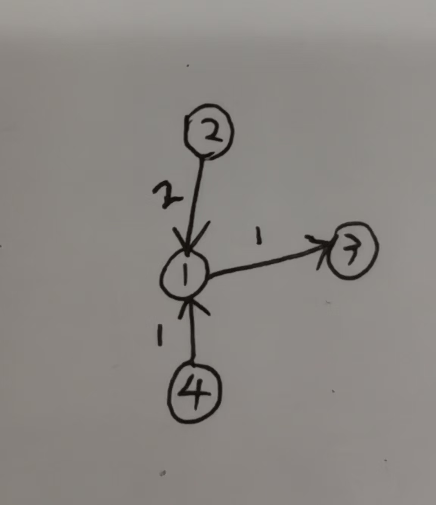

## 作业1
### 对无向无权图的一些解释（个人理解）
i智能体对j智能体的加权系数即i传j的占j收到的总数的占比。对于有向图就是看箭头指出的方向。
### 1.有向图的情况：
对于有向图，因为边有向，则当要计算某一智能体的加权系数时参与计算的应当是这一智能体的neighbor。均值一致算法的公式仍然成立。
例：
无向图：

此时，V6对V8的加权系数为：

而当变为有向图（无权）时：

V6的neighbor发生了变化，
V6对V5的加权系数为：

### 2.有权图的情况
在无向无权图的条件下，我们默认了每个连通的边都为1，而在有权的情况下，我们要把边的值也考虑进来。因此计算加权系数时仍要做出改动。
有权图（无向）：

当变为了有权图，应把边的权重带入计算：
V1对V3的加权系数为（设边的权重为D）：

而在不加权重的情况下，最终计算结果应是三分之一。
### 3.有向有权：
将两者结合起来，就能得出。
对某一个顶点，将它的非neighbor的边权重变为零，然后将neighbor的边的权重代入计算。
例：下为有权有向图：

计算V1对V3的加权系数：

由此我们就能够对原公式进行改写。